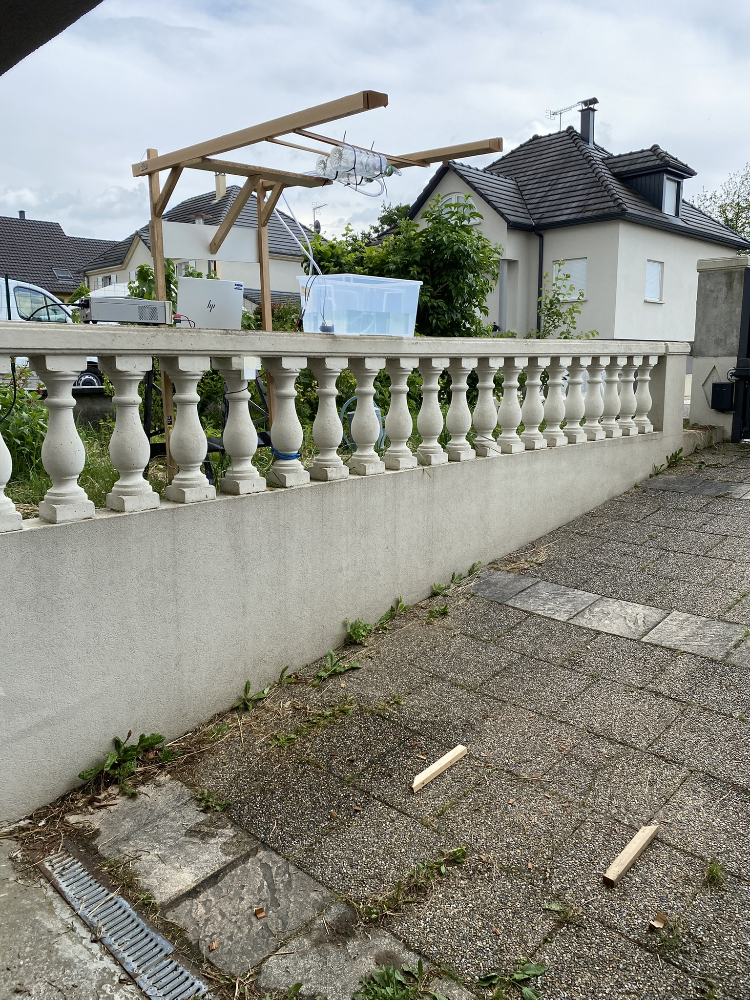

# Radar measurements analysis

Goal of this project is to evaluate the impact of the rain on radar measurements.

A test bench has been constructed, using two electropumps (each one with a flow rate of 280L/hour).

4 radar sensors have been evaluated:
- [Infineon BGT60TR13C](https://www.rutronik24.fr/produit/infineon/bgt60tr13ce6327xuma1/13893666.html) (60GHz FMCW radar)
-  [Infineon BGT60LTR11AIP](https://www.rutronik24.fr/produit/infineon/bgt60ltr11aipe6327xuma2/16172061.html) (60GHz Doppler radar)
-  [Infineon BGT24LTR11](https://www.rutronik24.fr/produit/infineon/bgt24ltr11n16e6327xtsa1/7859779.html) (24GHz Doppler radar)
-  [MineW ME73MS01](https://www.rutronik24.fr/produit/minew/me73ms01002/24550648.html) (24GHz FMCW radar)

Have a look to the PDF file (20250523_rain_test.pdf) to have an overview of the results. All the data that have been recorded and processed for this analysis are stored in the python_project directory.

The scripts that have been used to process and analyse the raw data are also available inside the python_project directory.

## Python project

### Needed libraries

A few libraries are needed to run the python project:

    pip install matplotlib
    pip install scipy
    pip install numpy
